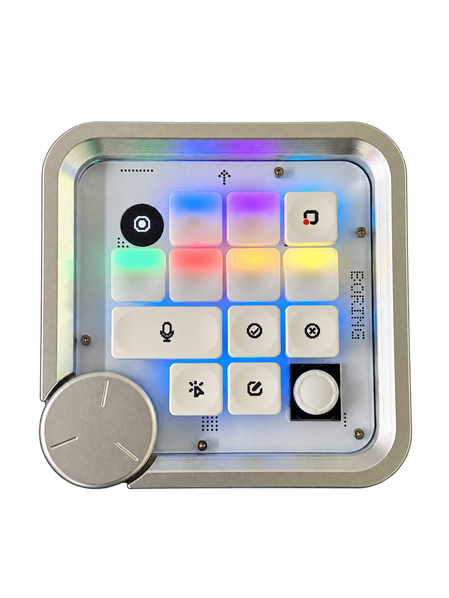

# BORING Developer Kit

让用户通过扩展、设备协议、控制台与固件源码，定义自己的 BORING 使用方式。

**固件源码已公开：[编译入口](firmware/README.md) · [DIY 可改、慎改与禁止改动范围](firmware/DIY-GUIDE.md) · [维护包格式与导入条件](firmware/PACKAGE-FORMAT.md)。USB、认证、更新、启动、分区、电源和存储底层坚决不要改。只有设备仍可正常连接、认证和更新时，才具备控制台恢复官方固件的前提。**

**先选择你需要的内容：**

- **直接安装使用：**[BORING 控制台 0.1.13 · M 系列 Mac 测试版](https://github.com/JoeySystem/boring-developer-kit/releases/download/console-v0.1.13/BORING-Console-0.1.13-macOS-arm64.zip) · [安装说明与已知限制](docs/install-console.md)。交付 ZIP 内含 DMG，不含固件。
- **更新官方固件：**[BORING MIST 20260916.01 维护 ZIP](docs/official-firmware-20260916.01.md)，适用于 Power V2 首批设备，状态为 `sample-verified`；需要新版官方控制台和正常 USB 更新会话。
- **查看或修改源码：**[开发包 v0.1.0-preview.9](https://github.com/JoeySystem/boring-developer-kit/releases/tag/v0.1.0-preview.9)。固件源码按功能对齐 `20260916.01`；控制台公开适配源码保持 0.1.46，另含 SDK 1.0.0、三个示例和协议，采用非商业许可。

**控制台公开源码为 0.1.46，公开安装包仍为 0.1.13；固件源码参考为 20260916.01。** 本次提供签名固件维护 ZIP 和相应源码开发包，两个 ZIP 用途不同。控制台公开源码保留系统字体、独立设置和本地服务，使用简化控件示意，不包含官方图标、品牌动画、产品模型、官方更新地址或发布记录。

[开始使用](START-HERE.md) · [下载本次 Release](https://github.com/JoeySystem/boring-developer-kit/releases/tag/v0.1.0-preview.9) · [兼容与验证边界](docs/versions.md) · [许可](LICENSING.md)

  
   
  BORING MIST · 产品实拍

## 本次可用的内容

| 内容 | 入口 |
|---|---|
| 固件源码、编译与 DIY 边界 | [firmware](firmware/README.md) · [修改与恢复说明](firmware/DIY-GUIDE.md) |
| 控制台源码、运行与构建 | [console](console/README.md) · [来源与边界](docs/console-source.md) |
| Python SDK 源码及安装说明 | [sdk/python](sdk/python/README.md) |
| 三个扩展及预期结果 | [示例说明](examples/README.md) |
| SDK 方法、返回值和错误处理 | [API 参考](docs/api.md) |
| 扩展 manifest、动作和提案 | [扩展接口](docs/extensions.md) |
| 设备事件字段 | [设备事件](docs/device-events.md) |
| USB / BLE WMP1 协议、配置 Schema 和公开测试向量 | [protocol](protocol/README.md) |
| 平台与配套控制台限制 | [兼容说明](docs/versions.md) |
| 修改、导入和重新打包自己的扩展 | [开发流程](docs/development-guide.md) |

## 运行前先确认宿主

SDK 是控制台本地 API 的客户端，**不是独立硬件驱动**。运行扩展需要具有扩展 Runner / API 1.0 的 BORING Console，以及控制台接受的设备会话。

控制台公开适配源码保持 2026-09-15 验收的 0.1.46 功能状态，程序标识为 **BORING Console Community**。可以按 [控制台说明](console/README.md) 从源码运行，也可使用兼容的官方宿主。SDK / API 版本不变。源码开发包不内含预编译固件；已签名官方维护 ZIP 是本次 Release 的独立附件，见 [使用说明](docs/official-firmware-20260916.01.md)。官方 0.1.13 安装包单独提供，见 [安装说明](docs/install-console.md)。具体结果见 [发布验证](docs/verification.md)。

SDK 1.0 仍围绕提示词槽位事件、绑定动作和映射提案，不提供全部原始输入或屏幕绘制接口；本次固件源码开放不会自动扩大 SDK API。见 [开放范围](docs/scope.md)。

## 下载与维护

Releases 分别提供官方控制台安装包、已签名固件维护 ZIP 和源码开发包；开发包另有三个扩展 ZIP 和 SDK wheel。GitHub 的 **Code → Download ZIP** 是仓库源码快照，不可直接当固件维护包导入。

包括本轮控制台代码在内的原创内容采用 **PolyForm Noncommercial 1.0.0**，商业复用另行书面授权。保留 NOTICE 与第三方许可，具体范围见 [LICENSING](LICENSING.md)。

按 [Best Effort](SUPPORT.md) 维护，不承诺固定响应、合并或发布周期。问题和需求请使用 [Issue 入口](https://github.com/JoeySystem/boring-developer-kit/issues/new/choose)，贡献方式见 [CONTRIBUTING](CONTRIBUTING.md)，版本变化见 [CHANGELOG](CHANGELOG.md)。
